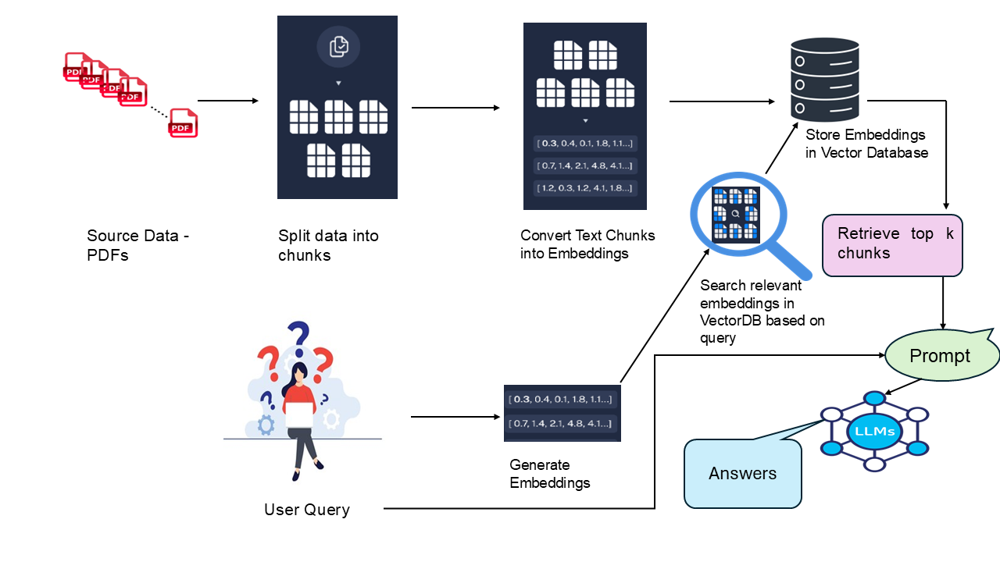

# PDF-Based QnA System Using Retrieval Augmented Generation (RAG)

## Overview
This project focuses on building a PDF-based search solution using Retrieval Augmented Generation (RAG) with OpenAI models. The approach enables efficient retrieval of relevant information from multiple PDFs by leveraging vector databases and embeddings for improved accuracy in responses.

## Thought Process
The workflow of this project is illustrated in the image below:



### **Processing Source Data**
The system starts with a collection of PDF documents that serve as the knowledge base. These PDFs are split into smaller text chunks to ensure better search accuracy and faster retrieval.

### **Generating Embeddings for Efficient Search**
Each text chunk is then converted into a numerical representation (embedding), which helps capture semantic meaning for similarity searches. The generated embeddings are stored in a vector database for efficient retrieval.

### **Retrieving Relevant Information**
When a user submits a query, it is also converted into an embedding and matched against stored embeddings in the vector database. The system retrieves the most relevant text chunks based on similarity searches.

### **Generating Answers Using LLMs**
The retrieved chunks are then used to construct a well-structured prompt, which is fed into a Large Language Model (LLM). The LLM processes the information and generates a relevant response based on the retrieved data.

## Features
- Splits text into chunks
- Extracts text from PDFs.
- Uses FAISS for efficient vector-based retrieval.
- Utilizes OpenAI's `text-embedding-ada-002` model for text embeddings.
- Queries are processed with OpenAI's `gpt-3.5-turbo-0125` model.
- Interactive command-line interface for question answering.
- Dockerized for easy deployment.

## Prerequisites
Ensure you have the following installed:
- Docker
- Python 3.10
- An OpenAI API key (set in a `.env` file as `OPENAI_API_KEY`)

## Installation
1. Clone the repository:
   ```bash
   git clone <repository-url>
   cd <repository-folder>
   ```
2. Set up your OpenAI API key:
   - Create a `.env` file in the project root.
   - Add the following line:
     ```env
     OPENAI_API_KEY=<your-api-key-here>
     ```

3. Add the PDFs folder:

- Place the folder containing **PDFs** in the working directory of  the project.

4. Update the Dockerfile:
- In your Dockerfile, update the following line to copy the PDFs folder to the /app/pdfs directory inside the container
```bash
   COPY <Path/to/PDFs_Folder/> /app/pdfs
   ```

##  Usage
### Building the Docker Image
1. Build the Docker image:
   ```bash
   docker build -t  <your docker image name> .
   ```

### Running the Container
2. Run the container 
   ```bash
   docker run -it <your docker image name> 
   ```

### Querying PDFs
3. Enter your queries in the command-line interface.
4. Type Ctrl+C to terminate the program.


## Scaling the existing system to more PDFs
Scaling RAG systems beyond millions of documents is an architectural challenge, not just a storage issue. As datasets grow, retrieval slows, accuracy drops, and infrastructure becomes complex. Efficient retrieval processes, data locality, and query efficiency are essential to maintaining performance.

## Scaling Challenges in FAISS
1.**Memory and Hardware Constraints**

- GPU-based FAISS indexes provide low latency but require high-end hardware (e.g., 80 GB A100 GPUs), making large-scale storage expensive.
- CPU-based indexes need hundreds of GBs of RAM, even with quantization, as storing billions of vectors can reach terabytes in size.

2.**Index Construction Time**
Building large-scale indexes (IVF, HNSW) can take days or weeks, making frequent updates difficult.
Real-time applications struggle since long indexing times mean data may become outdated before the index is ready.

3.**Recalculation Cost When Embeddings Change**

Updating the embedding model requires re-embedding and full re-indexing of billions of vectors, which is computationally expensive.


## Strategies to Overcome  Scaling Challenges in FAISS

### 1. IVF (Inverted File Index) and HNSW for Faster Search  
- **IVF (Inverted File Index):** Reduces the number of comparisons for large-scale datasets by clustering vectors.  
- **HNSW (Hierarchical Navigable Small World):** Enhances approximate nearest neighbor (ANN) searches for faster retrieval.  
- **Combining IVF + HNSW:** Leverages both techniques for efficient and scalable vector search.  

### 2. Sharding and Distributed Architectures  
- **Partitioning Strategy:** Split large datasets across multiple machines/GPUs, each holding a shard of the index.  
- **Query Routing:** Route queries to specific shards or broadcast to all and merge results.    

### 3. Hybrid or Multi-Tier Approach  
- **Hot & Cold Data Strategy:**  
  - Store frequently searched vectors in high-performance FAISS (GPU/CPU RAM).  
  - Move rarely accessed vectors to disk-based stores (e.g., DiskANN, Milvus).  
- **Pre-filtering:** Reduce the candidate set using metadata before running FAISS queries (e.g., filtering by category before similarity search).  

### 4. Incremental and Distributed Index Building  
- **Incremental Indexing:** Add new vectors without full re-indexing (limited support in FAISS).  
- **Pre-trained Quantizers:** Train the IVF quantizer once and assign new vectors to existing clusters for faster updates.  

### 5. Managing the Cost of Recalculation  
- **Selective Re-embedding:** Only update frequently accessed vectors or top X% of items.  
- **Cost vs. Accuracy Trade-off:** Evaluate indexing cost vs. accuracy gains before large-scale updates.  

### 6. Considering Alternatives
While FAISS is a powerful tool for vector search, it is not the only solution for scaling to larger datasets.

Scalable vector databases like Pinecone, Weaviate, and Milvus are optimized for high-dimensional vector searches, enabling fast and accurate retrieval using Approximate Nearest Neighbor (ANN) techniques. These databases provide APIs, plugins, and SDKs for seamless integration and support horizontal scalability. Additionally, platforms like Databricks and AWS offer managed vector database solutions that may be worth exploring for enterprise-scale deployments.


## Dependencies
- `dotenv` (environment variable management)
- `PyPDF2` (PDF text extraction)
- `FAISS` (vector database)
- `OpenAI ` (embeddings & GPT model)
- `langchain` (text chunking and vector store management)
- `Docker` (containerization)

